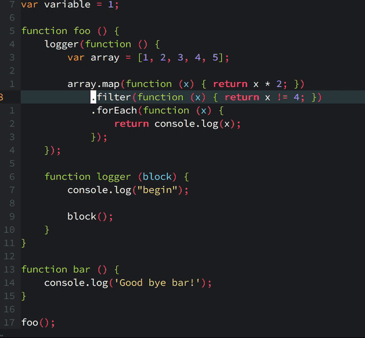

# vim-textobj-methodcall

This plugin defines a *methodcall* text objt for the [vim-textobj-user](https://github.com/kana/vim-textobj-user) plugin.



# Installing

With [vim-plug](https://github.com/junegunn/vim-plug):

```
Plug 'kana/vim-textobj-user' | Plug 'thalesmello/vim-textobj-methodcall'
```

# Default mappings

* `am`: around method call. Gets the method call of the surrounding scope.
* `im`: inner method call. Gets the method call of the current scope.
* `aM`: around method call chain. Gets the method call chain of the surrounding scope.
* `iM`: inner method call chain. Gets the method call chain of the current scope.

# Custom mappings

```
call textobj#user#map('methodcall', {
      \   '-': {
      \     'select-a': 'ac',
      \     'select-i': 'ic',
      \   },
      \   'chain': {
      \     'select-a': 'aC',
      \     'select-i': 'iC',
      \   },
      \ })
let g:textobj_methodcall_no_default_key_mappings = 1
```

For more details, look at the [vim-textobj-user documentation](https://github.com/kana/vim-textobj-user/blob/master/doc/textobj-user.txt).
